# 3.1 Powerpoint简介

## 3.1  PowerPoint简介

### 3.1.1 PowerPoint的工作环境及界面

#### 1.PowerPoint的界面

        单击Windows的“开始”按钮，选择“所有程序”中“Microsoft Office”子菜单中的 Microsoft Office PowerPoint命令，运行PowerPoint软件，界面如图3-1-1所示。

## 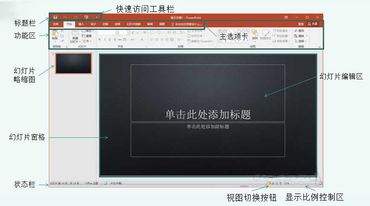

#### 2.标题栏

        标题栏位于窗口的最顶端。标题栏最左端显示当前程序图标，紧挨着的是快速访问工具栏，中间显示为当前演示文稿的名称（演示文稿1）和当前程序。

#### 3.快速访问工具栏

        快速访问工具栏是一个可自定义的工具栏，一般根据学习和工作需求，选择常用的工具。最常用和默认的依次是“保存”、“撤销”、“重复显示大纲”、“打开”四个功能按键，另外，可以向快速访问工具栏中添加代表命令的按钮。

#### 4.功能区

        功能区位于标题栏的下方。功能区由主选项卡、“功能区显示/隐藏”按钮和“帮助”按钮组成。单击主选项卡中的某个选项名称，可以展开该选项卡中的组和组内命令；单击快速访问工具栏中的“功能区显示/隐藏”按钮，可以显示/隐藏该选项卡中的组和组内命令；单击功能区中的“帮助”按钮，可以打开系统帮助，查看PowerPoint帮助信息。

#### 5.主选项卡

        主选项卡位于功能区的首行。由“文件”、“开始”、“插入”、“设计”、“切换”、“动画”、“动画片放映”、“审阅”、“视图”和“格式”共10个选项卡组成。每个选项卡中包含多个组，每组中又包含相关的操作命令。当鼠标指针指向某个选项卡名称时，该选项卡就会凸起，单击展开选项卡，显示各个组和组中的相关命令图标。

#### 6.“开始”选项卡

        PowerPoint软件启动后，系统默认显示“开始”选项卡，其中包括的组有：“剪贴板”、“幻灯片”、“字体”、“段落”、“绘图”和“编辑”，每个组中都包含相关的命令。将鼠标指针移至某个命令图标，该图标会呈现黄色高亮显示，稍后下方会出现命令说明提示框，单击可以执行该命令，完成相应的操作。

#### 7.“幻灯片”选项卡

        在普通视图中，其位于功能区的下方、演示文稿窗口的左边，系统默认是打开状态，幻灯片在其中是以缩略图的方式呈现的。在这里能方便地切换、重新排练、添加或删除幻灯片，并观看任何设计更改的效果。

#### 8.“大纲”选项卡

        在普通视图中，其位于功能区的下方、“幻灯片”选项卡的右边，在其中可以给幻灯片添加文本内容，对幻灯片进行新建、复制、移动和删除等操作。单击“关闭”按钮，可以隐藏选项卡。

#### 9.幻灯片窗格

        幻灯片窗格是演示文稿窗口中最大的工作区域，在幻灯片编辑区中可以编辑各种媒体信息，此区域的显示大小可以通过显示比例控制按钮进行设置。

#### 10.备注窗格

        位于演示文稿窗口的下部，用于输入一些备注的文字内容，此内容只供制作者参考，幻灯片在放映时不会显示出来。

#### 11.状态栏

        状态栏中显示有关执行过程中的选定命令或操作的信息。当选定命令时，状态栏左边便会出现该命令的简单描述。

#### 12.视图切换按钮区

        在状态栏的右部有3个视图切换和“幻灯片放映”按钮，单击这些按钮可以快速地切换视图方式和放映演示文稿。

#### 13.显示比例控制区

        在状态栏的最右端是显示比例控制区，此区域有“缩放级别”按钮、“缩小”按钮、“放大”按钮、“适应窗口”按钮和调整比例滑块。其中，单击“缩放级别”按钮时，可打开“缩放比例”对话框；单击“适应窗口”按钮，可使幻灯片适应当前窗口大小。

### 3.1.2 PowerPoint的文档操作

#### 1.文件

        文件主要包括“保存”、“另存为”、“打开”、“关闭”、“信息”、“最近所用文件”、“新建”、“打印”、“保存并发送”和“帮助”10个模块，下面对部分较为复杂的模块做简单的介绍。

**（1）另存为**

        “另存为”一般要注意保存位置，合适的位置有助于下一次准确的寻找到文件。另外要注意保存类型，为了防止有一些计算机安装为低一些版本的Office软件，使PPT不兼容不能正常播放，一般保存的时候为“PowerPoint 97-2003 演示文稿（\*.ppt）”，如图3-1-2所示。

## 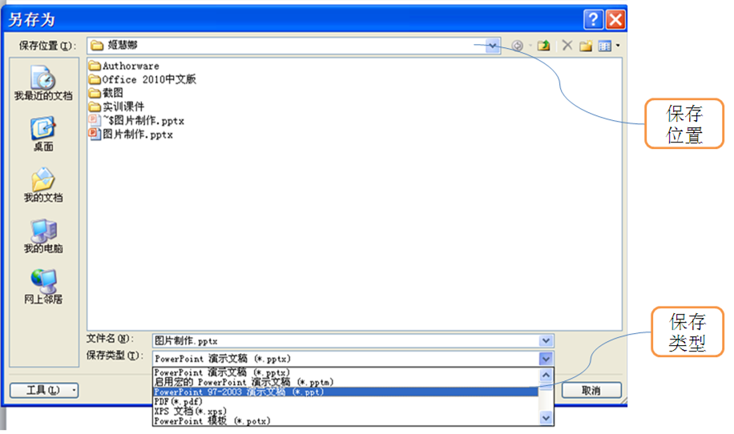

**（2）信息**

        “信息”主要包括“权限”、“准备共享”和“版本”三个部分。如果你自己制作的PPT成果，不想被他人复制、更改等，就可以利用“权限”的保护功能；“准备共享”指在共享此文件前，要注意其包含以下内容：“文档属性和作者的姓名以及残障人士无法阅读的内容。”“版本”的主要作用是对前面PPT文档的自动保存，可以对此前文档进行打开和删除。

**（3）最近所用文件**

        鼠标左键单击“最近所用文件”，会出现最近使用的演示文稿以及最近的位置标题栏， “最近所用的文件”的作用是方便使用者更快的查找到所需打开的文档。

#### 2.开始

        “开始”选项卡默认主要包括“剪贴板”、“幻灯片”、“字体”、“段落”、“绘图”和“编辑”共六个模块，下面对部分较为复杂的模块做简单的介绍。

**（1）幻灯片**

        “幻灯片”模块相对来说比较简单，根据字面意思就很容易理解，如图3-1-3所示。

## 

        鼠标左键单击“版式”，会出现如图3-1-4所示选项卡，读者可以根据需要，选择版式。

## 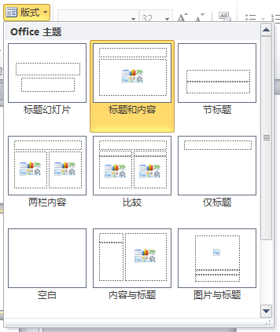

**（2）段落**

        这一部分内容比较复杂，也比较重要。为了使读者对这一模块有清晰的认识，笔者制作了如图3-1-5所示图片用以说明。

## 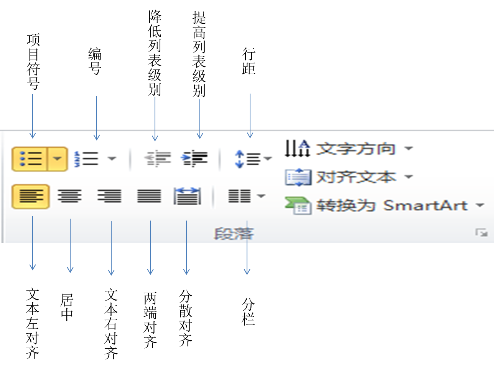

        ①“项目符号”的操作如图3-1-6所示。

## 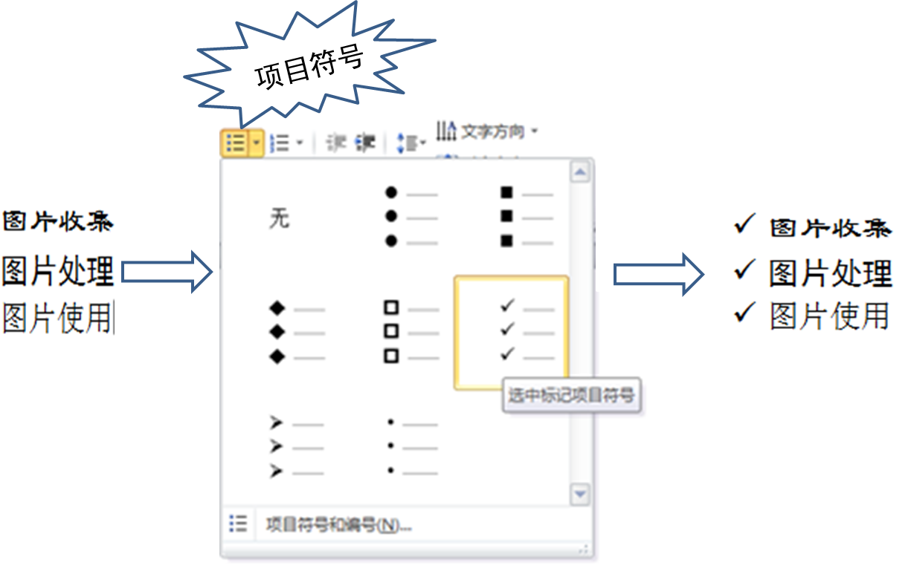

        ②“对齐”的操作如图3-1-7所示。

## 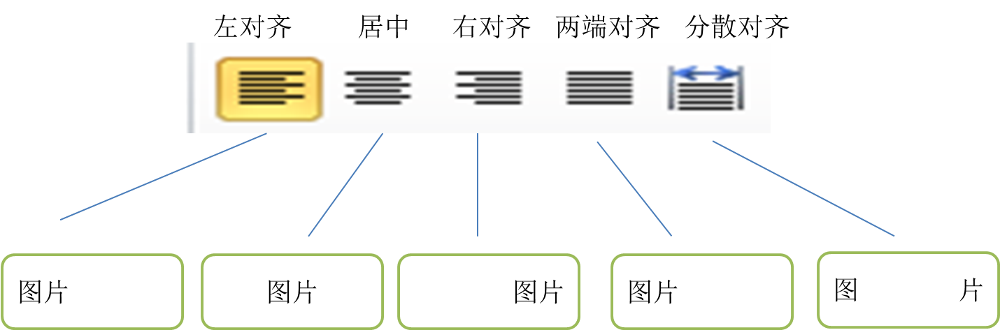

        ③“分栏”的操作如图3-1-8所示。

## 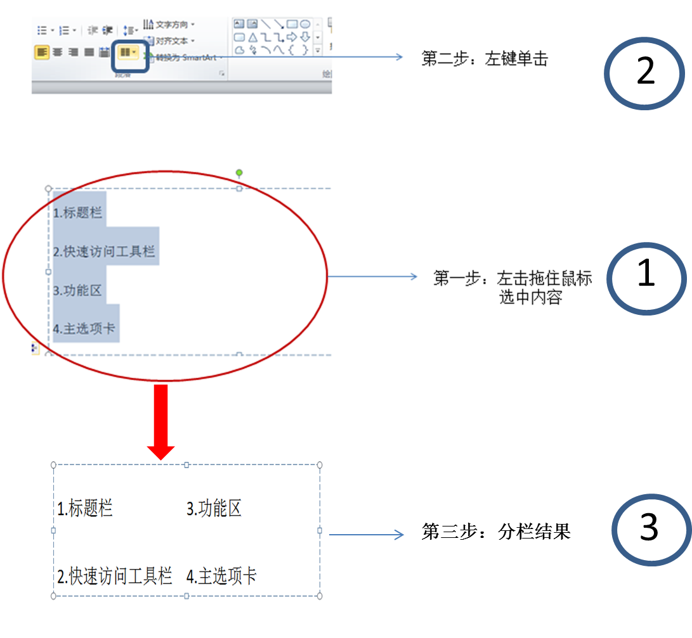

        ④“文字方向”的操作如图3-1-9所示。

## 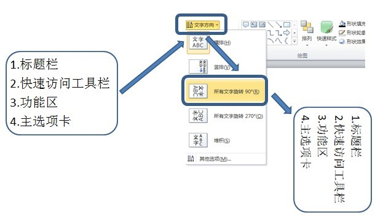

        ⑤转换为SmartArt图形的操作如图3-1-10所示。

## 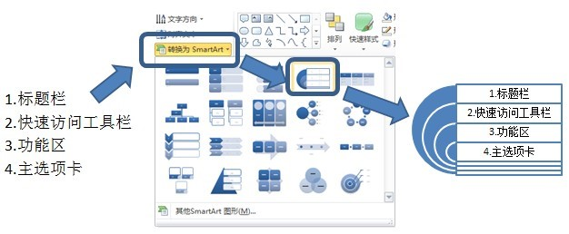

**（3）绘图**

        “绘图”主要包括如图3-1-11所示的几个部分。

## 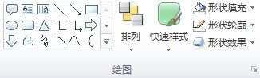

        “绘图”模块的使用可以通过以下七个步骤的操作来完成。

        **第一步：**绘制图形，按照如图3-1-12所示进行操作。

## 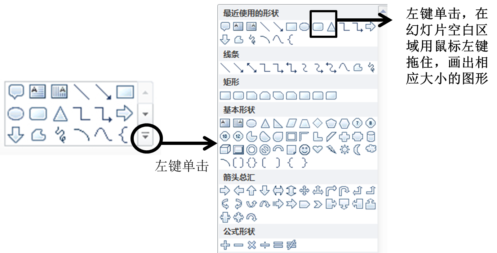

        **第二步：**形状填充，分别对长方形和三角形进行形状填充，鼠标左键单击白色，如图3-1-13所示

## 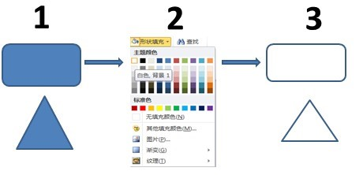

        **第三步：**形状轮廓设置，分别对长方形和三角形进行形状轮廓设置，如图3-1-14所示。

## 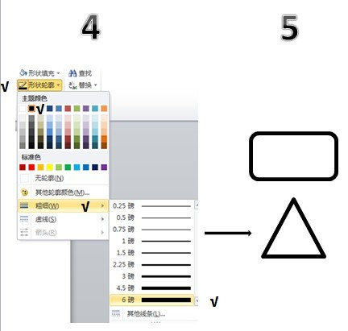

        **第四步：**形状效果（三维图形）设置，按照图3-1-15所示进行操作。

## 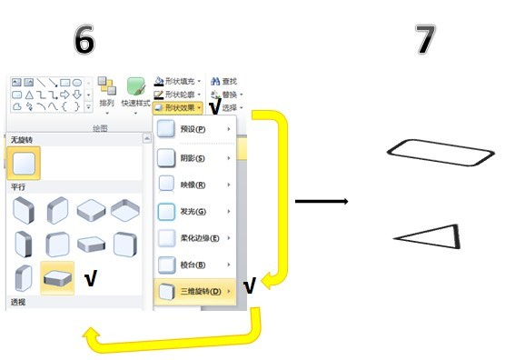

        **第五步：**快速样式设置，可以利用“快速样式”便捷地对图片进行美化，按照如图3-1-16所示进行操作。

## 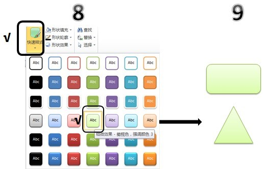

        **第六步：**排列图形，利用绘图的“排列”功能，使长方形位于三角形的上层，也就是说使长方形覆盖三角形，凸显长方形的全貌，按照图3-1-17所示进行操作。

## 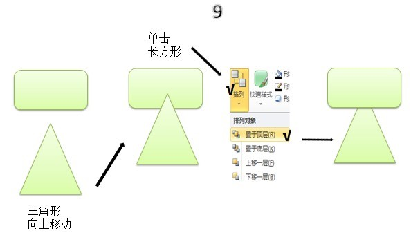

        **第七步：**组合图形，在我们利用PPT制作图形的过程中，往往会碰到图形移动不容易控制的情况，这个时候就需要对图形进行组合，具体操作如图3-1-18所示。

## 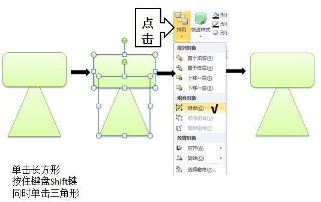

        由于本章篇幅的限制，笔者只能对“绘图”的部分功能做简单的介绍。“绘图”的功能非常强大，这就需要读者慢慢在摸索中学习，这样才能熟练掌握PPT的各项功能。

**（4）编辑**

        “编辑”主要包括“查找”、“替换”和“选择”三个选项卡。

        ①“查找”的作用是帮助读者快速在大篇段落中准确快速的查找到所需内容，具体操作如图3-1-19所示。

## 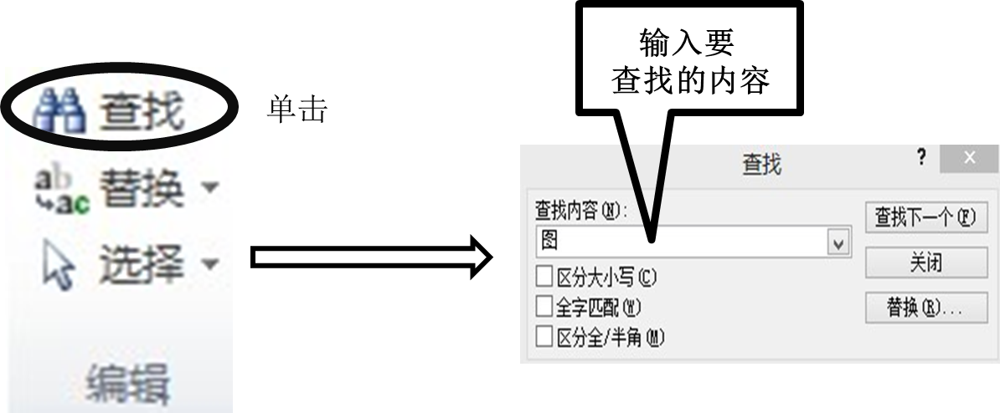

        ②“替换”的主要作用是可以快速准确的把本文件中的某个字或词等替换成别的字或词，可以帮读者省去大量的重复工作，当然也节省了大量的时间。

        ③“选择”的操作如图3-1-20所示，可以利用“选择”的“全选”功能，把各个窗口“合并”成一个整体的图形。

## 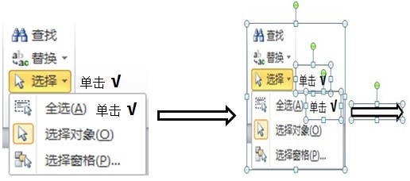

        这里介绍的很多操作，只是PowerPoint文档操作的一部分，如要掌握更多的操作，需要读者勤加练习。

