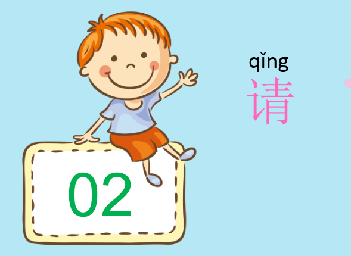
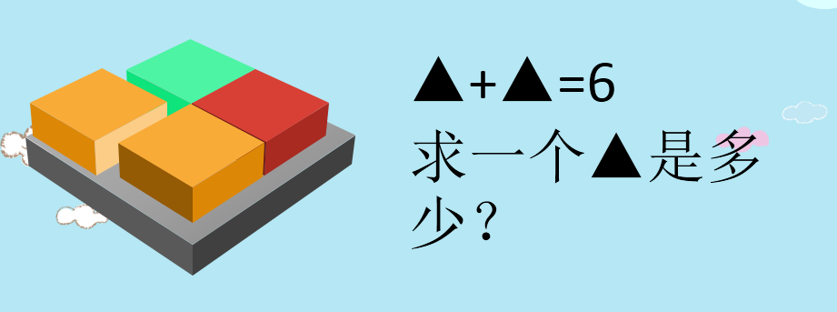
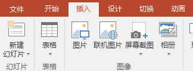
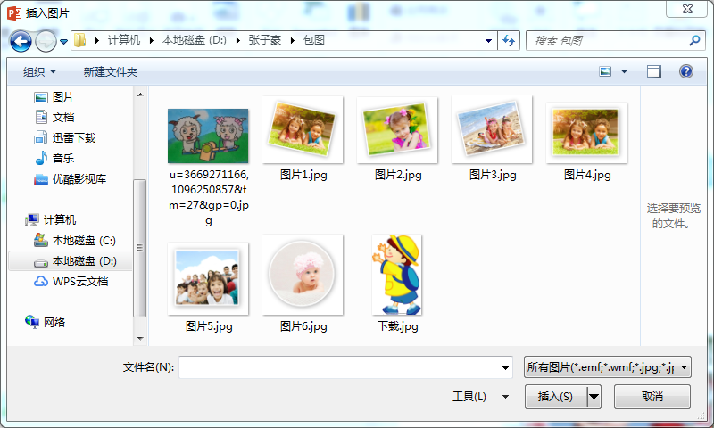
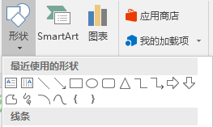
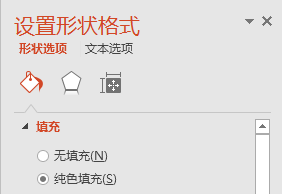

# 3.2 在Powerpoint课件中添加文字、图像和图形

## 3.2 在Powerpoint课件中添加文字、图像和图形

### 3.2.1  在课件中添加文字

        在PPT中我们不可以滥用文字，但是文字也必不可少。对于幼儿，使用一些文字是有必要的，但是我们应该合理控制使用文字的数量。幻灯片上不能直接输入文字，只能在占位符或文本框中输入文字。

#### 1.添加一般文字

        在PowerPoint中添加文字，通常使用文本框功能来实现。

## 

        \(1\)如图3-2-1。单击插入，然后找到文本框，点击文本框（可根据需要选择横版文本框或竖版文本框）

        \(2\)在文本框中合适的位置输入文字，然后根据需要对文字的字体，大小，颜色，字形等进行设置。如图3-2-2所示。

## 

### 2.添加艺术字

        比如说我们做图3-2-3中”勤洗澡，身体好”这一门课程，在PPT中做这个课的标题需要如下几步：

## 

        \(1\)首先单击【插入】选项，打开【插入】选项卡。如图3-2-4。

        \(2\)选择需要插入的艺术字类型。

        \(3\)点击文本框内输入需要插入的文字。

## 

#### 3.添加拼音

        我们在制作幼儿语文课件时，难免要给生字添加拼音。比如图3-2-5中的请字的拼音。文字输入我们已经学习过，下面我们学习制作这样的拼音。

## 

        \(1\)插入一个文本框，在里面输入需要的拼音字母（注音的字母除外）

        \(2\)光标放在文本框中，点击【插入】选项卡，在【插入】选项卡 中选择符号按钮。如图3-2-6。

## 

        （3）在符号中选择亚洲语言文本，右下角的来自选择简体中文，子集选拼音。在拼音中找到需要注音的字母插入，之后根据自己的需要设置拼音格式即可。如下图3-2-7所示。

## 

## 

#### 4.添加特殊符号

        在制作课间时，经常需要添加数学符号、单位符号、物理化学符号、标点符号等。我们可在文本框中输入特殊符号，然后运用设置一般文字的方法设置特殊符号的格式。

## 

        如图3-2-8。我们在课件中要输入这道题，但还不知道黑三角怎么输入进去，黑三角的输入方法为以下几步：

        （1）插入文本框;

        （2）光标放在文本框中，点击【插入】选项卡，在【插入】选项卡 中选择符号按钮。（同添加拼音第二步）;

        （3）在亚洲语言文本，子集为几何字型符中找到黑色三角，点击插入即可。

## 

        如果需要其他的特殊字符，可自行查找。

### 3.2.2  在课件中添加图像

        我们在制作幼儿课件时，为了更加吸引幼儿，有时候需要在课件内容中插入图像。插入的图像既要符合课件主题，也要美观。

#### 1.插入图像

        \(1\)单击【插入】选项，然后的点击【图片】选项。

## 

        \(2\)在合适的路径下选择需要插入的图片图片，点击插入。

## 

#### 2.编辑图像

        课件中插入的图像有时候有一些缺陷，如亮度、对比度、大小、位置和无效部分等方面，需要进一步调整和设置，统一图像样式，才能使其在幻灯片中更加合适、美观。接下来我们来学习一下如何用Powerpoint处理图像。

        单击需要处理的图像，Powerpoint上会出现图片工具，格式。单击格式，会出现以下选项。我们可以根据以下选项来处理图像。

## 图3-2-12 编辑图像

        \(1\)裁剪图片。在【格式】中有【裁剪】命令，通过该命令进行裁剪图片。

## 

        \(2\)删除图片背景，同裁剪图片一样，在【格式】中选择【删除背景】进行操作。

        \(3\)调整图片大小，位置。旋转图片。选中图片后，点击鼠标右键，选择“大小和位置”。在“设置图片格式”窗口中可以调整图片的大小和位置，也可以旋转图片。

## 

        \(4\)调整颜色。同裁剪图片，在【格式】中选择【颜色】进行调整。

        \(5\)统一图片样式。选中所有需要统一样式的图片，在【格式】中找到【图片样式】，选择合适的样式单击即可。

## 

### 3.2.3  在课件中添加图形

        在制作幼儿课件中，我们需要插入合适的图像使课件的效果更好。

#### 1.插入图形

        （1）单击【插入】选项卡，点击形状选项。

## 

        （2）在【形状】中选择合适的图形，点击。然后在幻灯片上绘制即可。

## 

#### 2.编辑图形

        单击需要编辑的图形，Powerpoint上方出现【格式】，右侧出现【设置形状格式】窗口，在两个选项中可以对图形进行编辑。编辑图形与编辑图像相似，请参考编辑图像部分。

## 

## 

