# 3.4 Powerpoint课件的美化

## 3.4 Powerpoint课件的美化

        这一节内容主要讲的是PPT课件的美化：

        PPT的美化：既能体现课件的美观性也能更加凸显PPT的实用性，为达到美化的效果，我们需要对课件的背景、色彩、版式、主题和外观等进行美化。

        首先，我们先把需要的内容整理好备用。（文字、图片等）

## 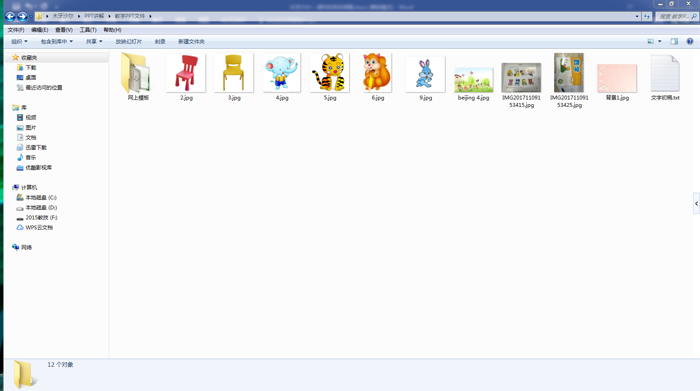

        开始 【新建幻灯片】添加标题和副标题。

## 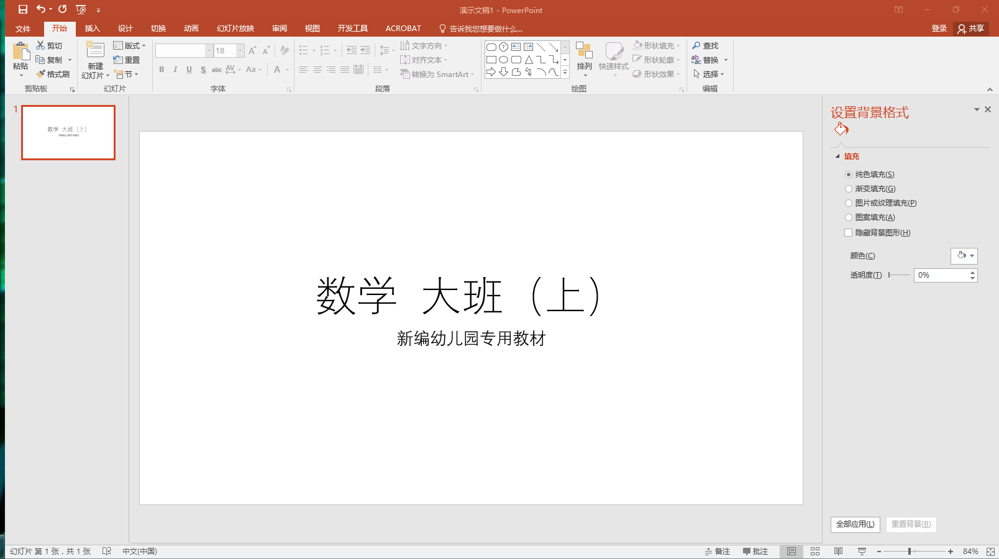

### 3.4.1课件的色彩搭配

        （对于大部分人来说，都没有专业的学习过色彩搭配，所以都尽可能的选择色调简单的图片，这个不用担心，接下来我们先从课件的色彩搭配讲起，为后面讲解的背景和字体颜色做铺垫）

        很多初学者开始在做课件的时候都会有个困惑，在幻灯片上输入文字的时候，往往字的显示不是很清楚，或者被背景颜色挡住或者被图形颜色挡住，这是幻灯片的大忌，所以我们要适当的了解一下色彩的搭配。色彩是一门大学问，它是一个感官的东西，所以对色彩的感觉也是因人而异。比如说买到一件不论是原材料、颜色还是款式都是非常好的上衣，但是如果与裤子没有搭配好，那么上衣的品质也是大打折扣的。

        在制作课件的过程中，普通的人很难像色彩大师或设计专家那样精准地运用色彩，基本的标准就是制作出来的作品让人看着舒服就可以。最简单的方法，就是运用Powerpoint软件中自带的模板和色彩搭配。如果想要制作有鲜明特色的课件，学习简单的色彩知识还是很有必要的。

        常用的色环有24个色调，为了使读者阅读方便，这里选用的是12色调的色环，如图3-4-3所示。24个色调是基于三原色，即红、黄、蓝，这三个分别组合，则是新的颜色，即橙、绿、紫。看这个色环，不难找出其中色彩组合的规律。那么，在课件的色彩搭配中应该怎么运用这个色环呢？

## 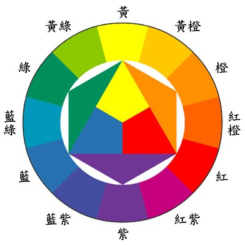

        在课件制作中，比较忌讳使用两个相近的颜色，也就是色环上相近的颜色。色环上相对的颜色称为互补色。一对互补色相结合，效果对比非常强烈，容易对人的视觉产生刺激。不过最大的好处仍然是较强的对比，会使文本显示的非常清晰，观众读起来不会产生疲惫感。红配绿是超级经典的互补色，尽量不要大面积的使用。就像我们通常穿衣服一样，红上衣配绿裤子，估计都是笑掉大牙的搭配了，但是如果为了突出重点，还是可以使用的，就像舞台剧一样，这样的搭配也是很常见。

        如图3-4-4所示，如果红色形状背景搭配红紫色，则文字显示的很模糊，使人看着非常难受。如果红色形状背景搭配对角线中的绿色，则文本显示的非常清晰，对比非常强烈。在课件中，字体尽量不要选用和底色互补的颜色，这样过于扎眼，仅限于局部使用。所以，色环上相邻和对角这两种都是不推荐的色彩搭配。

## 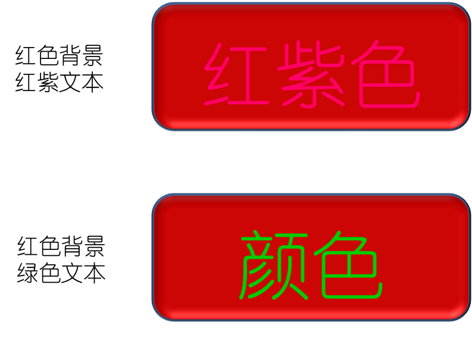

        色环中相距135°的两个颜色为对比色关系，属于中强对比效果的色组。这种对比效果也很明显，可以清楚的看到文本，但不会觉得很扎眼，非常适合文字与背景的色彩对比。如图3-4-5所示，红色的形状背景搭配135°对角线的蓝色和黄色，看起来还是比较“和谐”。

## 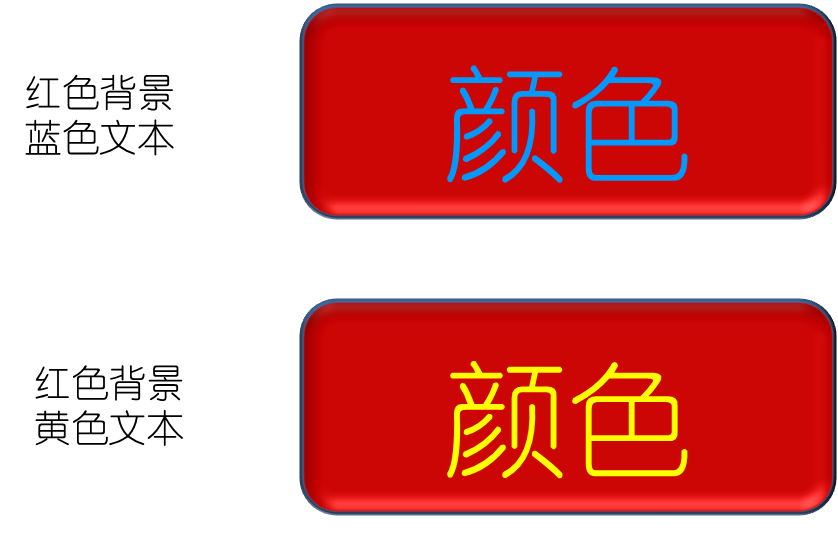

        在众多课件制作的书籍中，李治在色彩搭配这一块，可谓是“泰斗”。她推荐了几个常用的颜色搭配：

        1.模板的底色——白色、黑色、灰色调；切忌——橙色、大红以及色彩缤纷的图片或水印。

        2.内容的文字、标题——黑色、白色、深蓝色。

        3.用来强调的线和图形——白底用艳色（红、绿等纯色）；黑底用亮色——黄色、橙色。

### 3.4.2课件的背景设置

        点击【右键】选择【设置背景格式】再根据需要选择填充模式，现在我们举例讲解的是【图片或纹理填充】在插入图片文字下点击【文件】选择准备好的图片点击【插入】

## 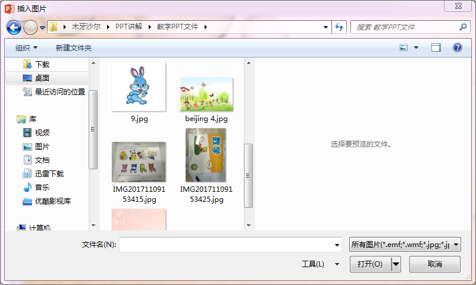

## 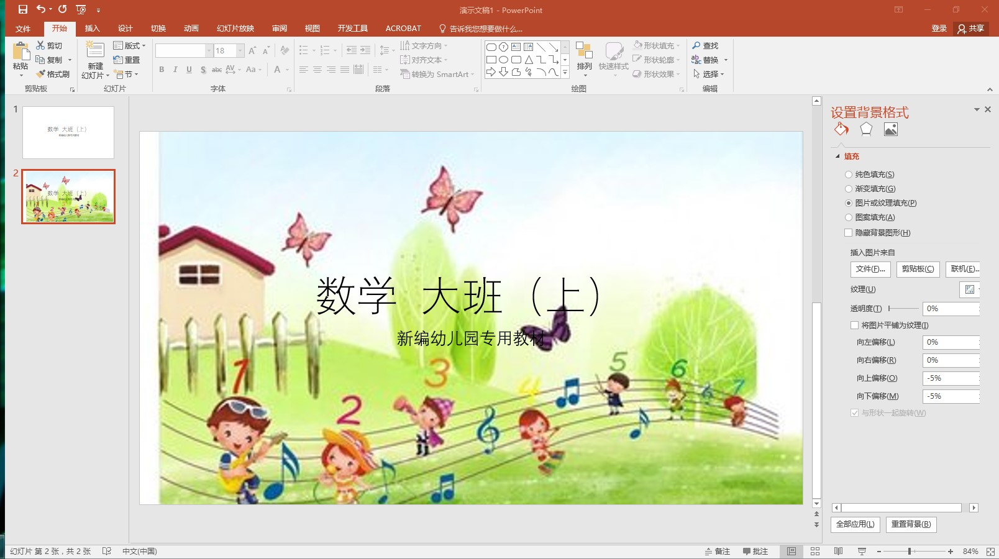

        加入背景之后，发现视觉效果杂乱，字迹不清晰,提出PPT课件背景图片尽可能的简单大方，再换另一组背景。

## 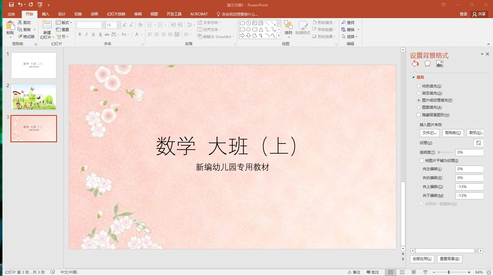

        相对于第一次的背景图片，第二次的背景图片更显得“字字”分明，主题突出，简单明亮也美观。

### 3.4.3课件内容、字体和字号的调整

        讲到这个内容，让我们一起举例输入要讲的教学内容（ 以幼儿教材数学大班（上）的教学内容为例 ）。

        一样点击【右键】选择【新建幻灯片】根据教学内容点击工具栏【插入】插入需要的文本框、图片以及文字内容。

## 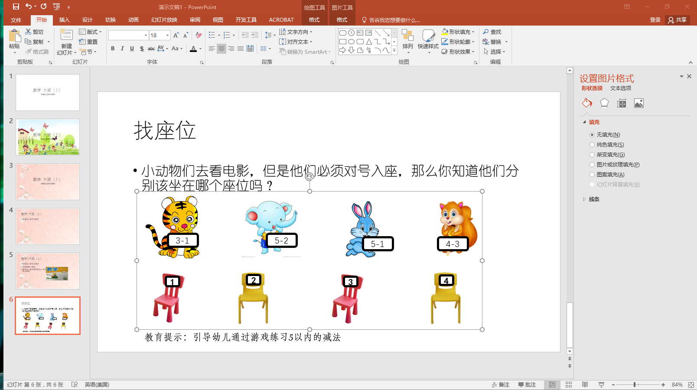

        学会了更改背景之后，我们需要灵活的调整课件内容、字体和字号使得PPT更加美观，图文和谐，使学习者清楚明了，准确获取信息。

        点击工具栏【开始】选择要调整的文字更改适合的字体和字号。插入图片为了方便可以全选点击【右键】选择【组合】。

## 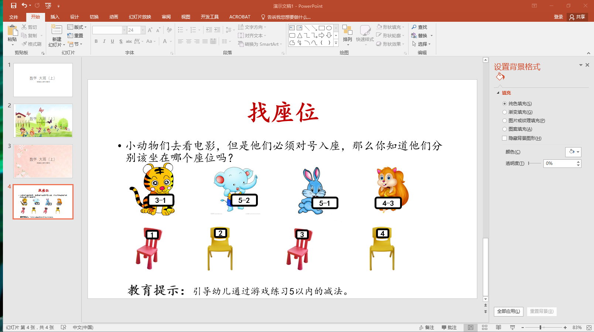

        字体大小可以根据强调的重要性更改颜色和大小，吸引学习者的眼球。挑选字体尽量统一，足够清晰，不受投影仪设备的影响。

### 3.4.4课件的版式设置

        关于内容、字体和颜色已经学习过了，现在需要的是课件的整体布局，对课件的版式进行设置和应用，可以使课件结构更加合理，布局更加完美。给PPT添加背景图片、颜色或者水印，可以使得课件独具特色。

        选择标题幻灯片为例：【左键】点击选择标题幻灯片，点击【右键】选择【版式】。

## 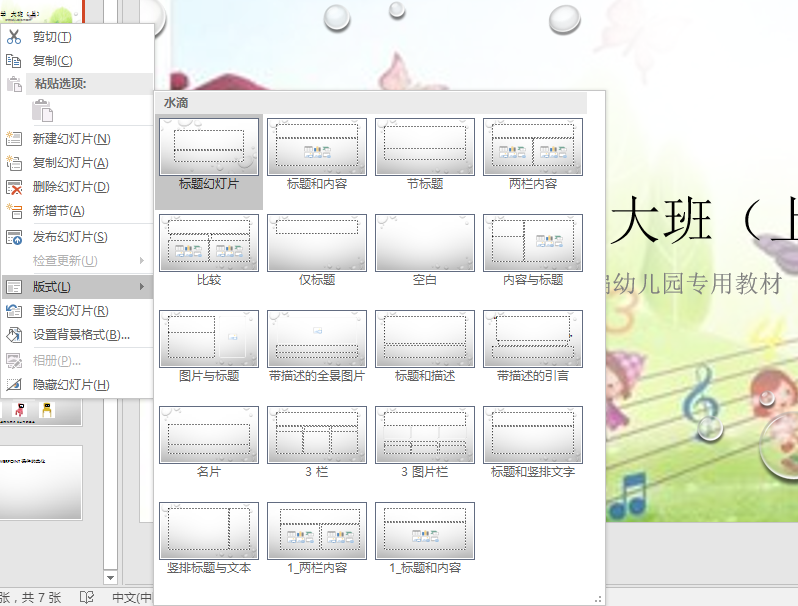

## 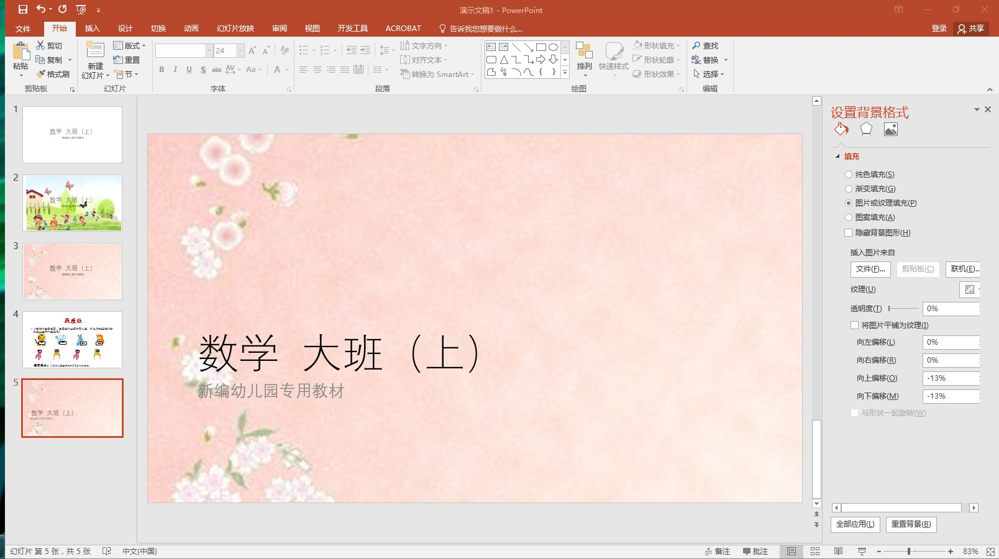

## 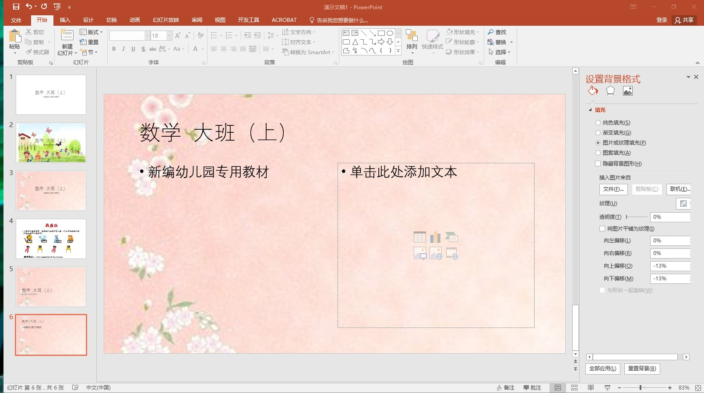

        课件的版式很多，我们可以根据自己的需要更改利用，接下来用版式2做一个例子。

## 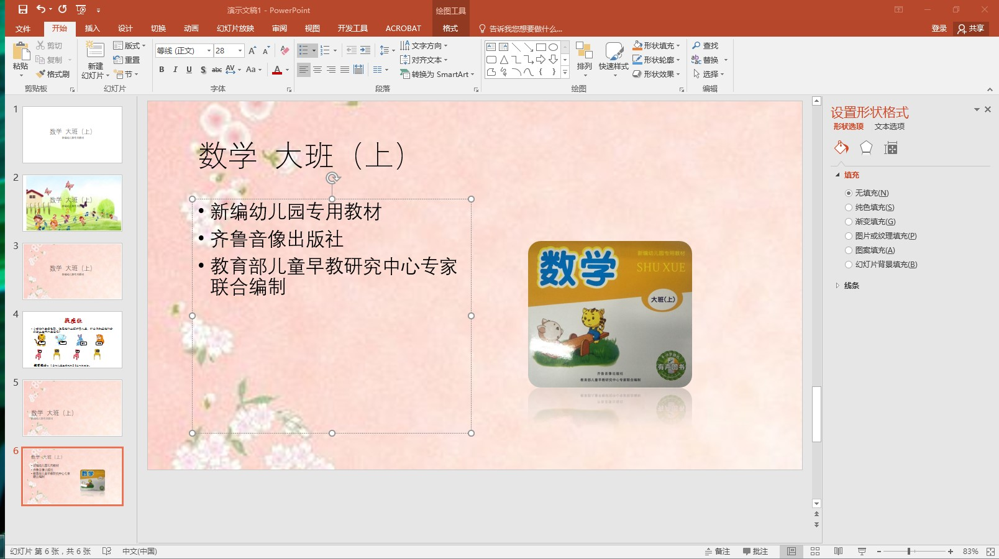

### 3.4.5课件的主题设置

        在PowerPoint课件中，使用主题颜色、字体和效果，可以使课件具有统一的风格。如果每一张幻灯片都有不同的背景，而且字体、颜色、字号都不一样，看起来就会非常杂乱。这个时候，就能发现Powerpoint主题的作用了。

        当课件中的幻灯片背景改变时，幻灯片上的文字、图片、图形等颜色，以及字体和效果也需要随之改变，才能保证搭配协调，如果这样边想边改，工作量就会非常大。为了减少工作量，使用预先设计好的主题，便可以轻松快捷的更改课件的整体外观。系统提供了多种内置的主题颜色、字体和效果，读者可以根据自己的喜好进行选择。

### 3.4.6课件的模板设置

        一个完整的Powerpoint模板从功能上分为首页、概述页、过渡页、内容页和结束页。它们扮演着不同的角色，都是为了Powerpoint的整体服务的。具体来讲，无论它们是什么功能，字体、字号、底色等基本的设计风格应该一致；但从功能上考虑，还是要有所区别。

        首先，首页的主要功能是说明讲什么，谁来讲。其次，概述页的主要功能是使听众在正式内容前有一个全局观。过渡页的功能是说明下一章节的内容，一般适用于篇幅较长的课件。内容页的功能就是陈述主要内容以及观众最关心的内容，要多使用简单完整句。最后，千万别忘了感谢听众，我们一般把这部分内容放到结束页中。

        不论是在网站上下载模板，还是自己设计模板，都要考虑到这几种版式的特征。先把它们的布局固定下来，然后在整个课件里进行到底，以保持一致性。

