# 3.8 课件中使用触发器产生交互

## 3.8 课件中使用触发器产生交互

### 3.8.1使用文字触发器交互

        课件在播放过程中，根据教学的需要点击课件中的特定文字内容，会呈现新的文字信息。再单击新出现的文字信息，此信息会自动关闭。这种课件中文字呈现与消失的方式可使用触发器进行设置制作。

        本实例以幼儿园大班音乐（下）中的“国旗多美丽”制作为例，着重介绍文字触发器的交互作用。

#### 1.设置文字出现触发器

        \(1\)运行PowerPoint，打开课件中的“国旗多美丽”幻灯片。如图3-8-1。

## 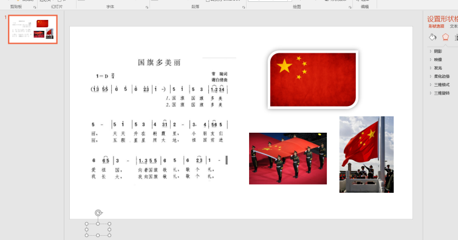

        2.制作要点击的文字。按照如图所示操作，点击插入→文本框，在插入的文本框中添加文字“国旗”，并设置文字格式与幻灯片上文字的格式相同。如图3-8-2。

## 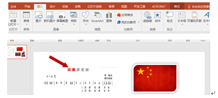

        3.制作解释文字。本步骤和上一步骤相似，插入文本后，设置格式，并把文字放到相应合适的位置。如图3-8-3。

## 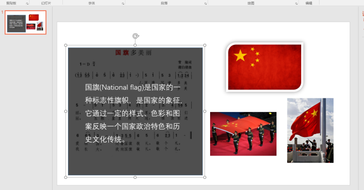

        4.设置触发效果。点击制作好的解释文字文本框，点击【动画】→【添加动画】如图3-8-4，设置文字的进入方式并触发显示。如图3-8-5。

## 

## 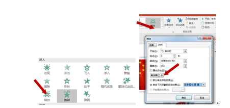

#### 2.设置文字消失触发器

        文字消失动画。点击制作好的解释文字文本框，点击【动画】→【添加动画】，设置文字消失方式并触发消失。如图3-8-6。

## 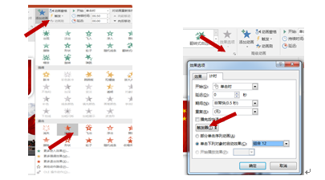

### 3.8.2使用图片触发器交互

        在PowerPoint课件过程中，有时某页可能需要同时出现多幅图片，可以借助触发器交互功能，根据教学需要，放大突出其中任意一幅图画，使课件突出重点。

#### 1.设置图片出现触发器

        \(1\)找到需要制作的幻灯片，插入需要展示的图片，并调整图片的大小、位置。如图3-8-7。

## 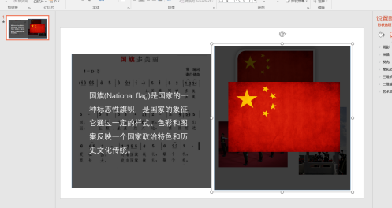

        \(2\)设置触发显示。点击大尺寸图片，点击【动画】→【添加动画】，设置图片呈现方式和触发显示。如图3-8-8。

## 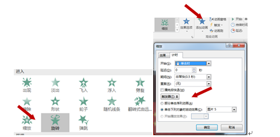

#### 2.设置图片消失触发器

        \(1\)图片消失动画，选择比较大的图片，和以上类似，点击【动画】→【添加动画】，设置图片消失方式并触发消失。如图3-8-9。

## 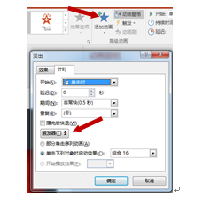

### 3.8.3使用声音触发器交互

        在PowerPoint中，有时某页可能需要插入音乐，根据教学需要，需要随时播放或暂停其中指定的声音。

#### 1.设置声音播放触发器

        \(1\)找到需要插入声音的那页幻灯片，点击【插入】→【音频】，插入声音。如图3-8-10。

## 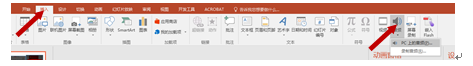

        \(2\)设置触发播放声音。点击【动画】→【添加动画】，按照如图所示操作，设置声音触发播放。如图3-8-11。

## 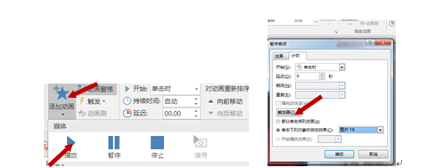

#### 2.设置声音暂停触发器

        \(1\)设置触发暂停声音。添加动画和上一步类似。如图3-8-12。

## 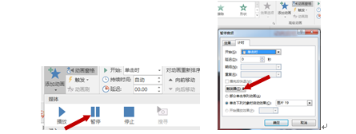

