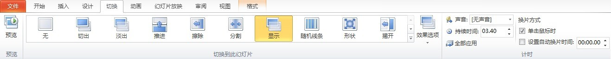
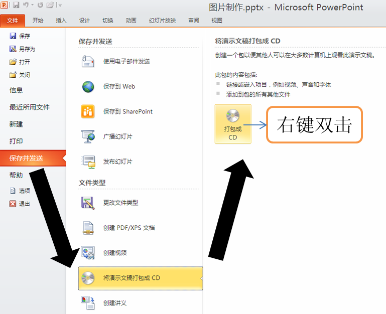
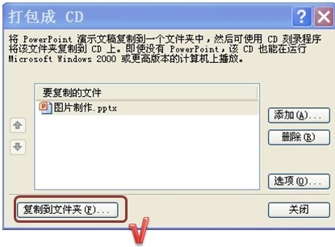
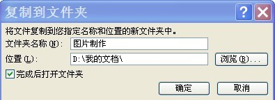

# 3.9 Powerpoint课件的输出

## 3.9 Powerpoint课件的输出

        课件创建后，为进一步增强它的观赏性，可以在幻灯片之间加入不同的切换效果；为了控制各教学内容的讲解时间，可以设置各幻灯片的播放时间；为使课件能够在不同的机器上正常放映，可以对课件进行打包。

### 1.设置幻灯片切换效果

        幻灯片切换包括预览、切换到此幻灯片和计时三个部分，如图3-9-1所示。幻灯片切换效果的设置相对来说比较简单易懂，读者可以根据自己的兴趣进行设置和练习。

## 

### 2.课件的打包

        课件制作完成后，往往不在同一台计算机上播放，如果仅仅将制作好的课件复制到另一台计算机上，而该机又未安装PowerPoint应用程序，或者因为版本不同导致课件出现故障而不能顺利播放。因此，保险起见，一般在课件制作完成后可以将课件打包，也就是“打包成CD”，方法如下。

        （1）在PowerPoint中打开想要打包的课件，依次选择“文件”菜单中的“保存并发送”—“将演示文稿打包成CD”—“打包成CD”，如图3-9-2所示。

## 

        （2）在弹出的“打包成CD”窗口中，既可以选择添加更多的Powerpoint文档一起打包，也可以删除不要的Powerpoint文档。鼠标左键单击“复制到文件夹”按钮，如图3-9-3所示。

## 

        （3）在弹出的窗口中，选择路径和演示文稿打包后的文件夹名称，根据需求选择想要存放的位置路径，也可以保存默认不变，最后单击“确定”按钮，如图3-9-4所示。

## 

