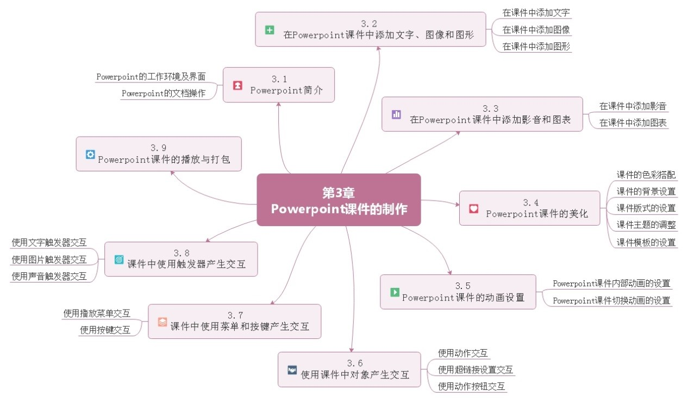

# 学习目标与知识图谱

### 学习目标

            1.熟悉Powerpoint的工作环境及界面。

            2.熟练Powerpoint课件制作的基础操作。

            3.初步掌握课件颜色的搭配技巧。

            4.掌握Powerpoint课件版式、主题和模板的设置方法。

            5.掌握Powerpoint课件动画效果的设置方法。

            6.掌握Powerpoint课件播放效果的设置方法及课件打包的方法。

### 知识图谱

## 

