# 4.3 在Flash课件中添加文字、图像和图形

## 4.3 在Flash课件中添加文字、图像和图形

### 4.3.1 制作文本

        文字是Flash课件中的重要对象，Flash 在文字处理方面具有强大的功能。用文本工具可以直接输入文字，并且可以改变文字的字体、大小、颜色等属性，还能设置滤镜效果。

#### 1.文本工具的使用

        选择【文本工具】T——鼠标移至舞台后按住鼠标左键并拖动就会插入文本框——光标闪烁，即可输入文本。如图4-3-1所示。

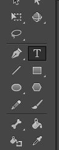

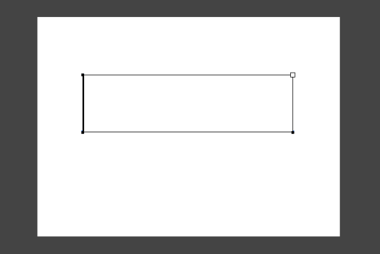

## 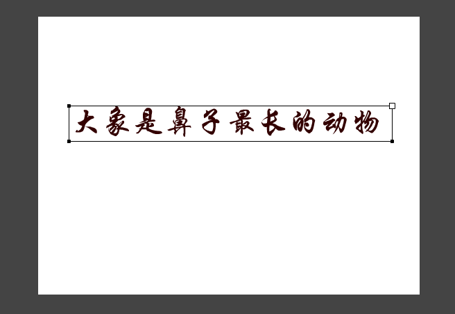

#### 2.文本工具属性设置

        可通过文本工具的属性面板来进行设置。如图4-3-2所示。

        【文本类型】下拉列表框：可以选择文本的类型，有静态文本、动态文本、输入文本3种。默认为静态文本类型。

        【字体】下拉列表框：可以选择字体类型。

        【字体大小】文本框：用来设置文字的大小，可以直接输入数字，也可以通过拖动滑杆设置字体大小。

        【文本颜色】按钮：单击该按钮弹出调色板，在其中可以设置字体颜色。

        【文本对齐方式】按钮：用来设置文本的对齐方式，有左对齐、居中对齐、右对齐、两端对齐4种。

        【改变文本方向】按钮：单击该按钮右下角的小三角，可以选择文本的方向，有【水平】垂直，从【左到右】垂直，从【右到左】3种类型。

        【字母间距】文本框：直接输入数字或者拖动滑杆调整字符的距离。

        【字符位置】下拉列表框：用来设置字符的位置，其中包括一般、上标和下标3项。

        【URL链接】文本框：可以为文字设置网页或程序的链接。

        **注意：文字格式设置的部分功能也可以通过【文本】菜单的相应命令执行。**

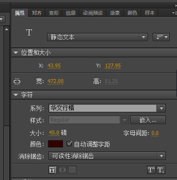

## 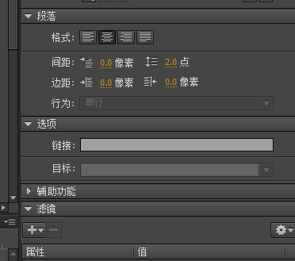

#### 3.设置文字滤镜效果

        单击【滤镜】选项——单击按钮——选择滤镜效果类型。如图4-3-3所示。

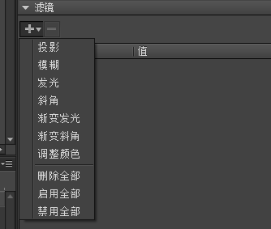

## 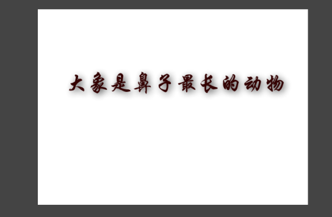

### 4.3.2 制作图形

        Flash的主要功能是制作动画，利用 Flash动画可以设计出丰富多彩的动态课件。但是Flash动画的基础是图形，没有图形也就不可能产生动画。因此，要想制作出更加生动逼真的F1ash动画课件，就必须先掌握一些简单图形的绘制方法。

        【工具】面板是 Flash 课件制作中使用最频繁的一个面板，在学习和使用之前有必要认识它的全貌，以便更好地使用。【工具】面板位于舞台左侧，它由【工具】、【查看】、【颜色】和【选项】四部分组成。在 Flash中【工具】面板可以自由地安排为单列或双列显示，单击【工具】面板上方的三角按钮可以在两种状态之间变换。图 4-3-4所示的是【工具】面板显示为双列的状态。注意：可以自定义【工具】面板中的工具编排次序，选择【编辑】→【自定义工具面板】命令，打开【自定义工具栏】对话框，可以根据需要和个人喜好重新安排和组合工具的位置。

## 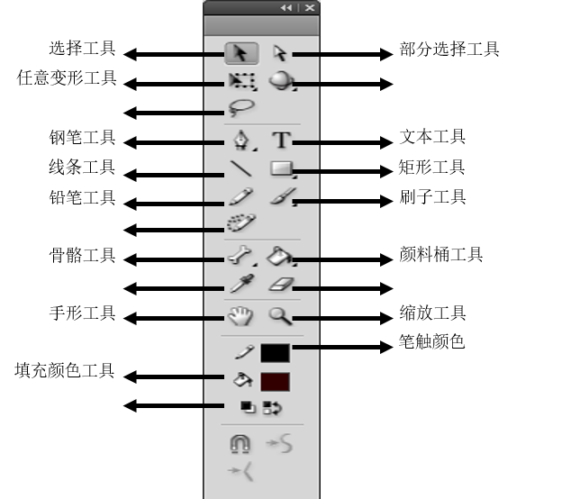

* 选择工具 ：用于选取对象文本，按住【Shift】键，可同时选取多个对象。
* 部分选择工具 ：选取对象的锚点和路径。
* 任意变形工具 ：对对象进行任意旋转、变形和缩放等操作。
* 套索工具 ：选择舞台不规则的区域。
* 钢笔工具 ：绘制直线、曲线、并对曲线进行调整。
* 文本工具 ：输入和修改文本。
* 线条工具 ：绘制任意方向的线条。
* 矩形工具 ：默认为矩形工具，绘制任意大小的矩形。
* 铅笔工具 ：绘制任意形状的直线或曲线。
* 刷子工具 ：绘制任意形状的曲线，曲线形状主要由其轨迹决定。
* 颜料桶工具 ：用设置好的内容来改变矢量线的颜色。
* 滴管工具 ：吸取已有对象属性的色彩属性，并将其应用到当前对象。
* 橡皮擦工具 ：擦除舞台对象。
* 手形工具 ：移动编辑区。
* 缩放工具 ：放大或缩小编辑区。
* 笔触颜色 ：设置所选对象轮廓的颜色。
* 填充颜色工具 ：设置所选对象的填充色。

### 4.3.3 位图的应用

        位图资源极其丰富，而且表现力非常强，一些复杂的图形图像课件必须使用位图才能实现效果。因此，掌握在Flash中利用位图制作图形图像课件，是一种很重要的技能。

#### 1.导入位图

        选择【文件】——【导入】——【导入到舞台】——按住Ctrl键，依次单击图像文件，导入课件所需的多个图像文件。 导入舞台的图像会自动分布在场景的舞台上，按Delete键，将场景中的图像文件全部删除。但图像文件保存在【库】面板中。如图4-3-5所示。

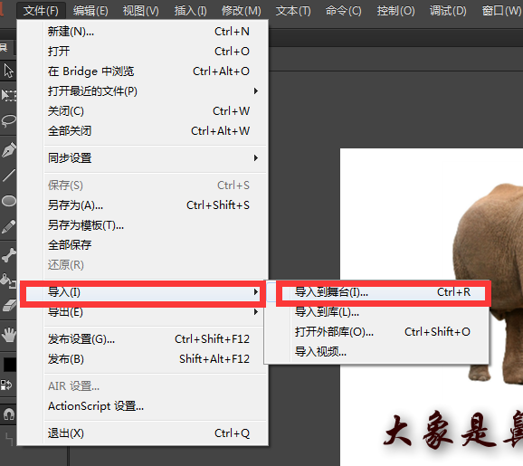

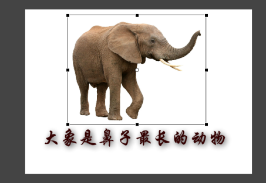

## 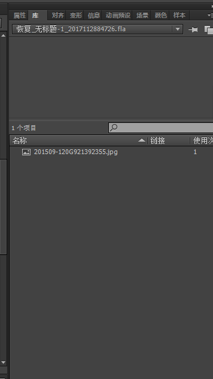

#### 2.使用套索工具编辑位图

        导入的位图往往有背景，不利于课件整体分割的设计，极大影响课件效果，可以利用【套索工具】和【橡皮擦工具】来清除图像背景。以下是【套索工具】的使用方法。【套索工具】用来选择任意图形，它有套索工具、多边形工具和魔术棒3种模式。 如图4-3-6所示。

## 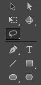

        【魔术棒】：使用该工具可以在位图上选择颜色相近的区域，只需在图形上单击要选择的区域，就会有连续区域被选中。

        【多边形模式】：使用此工具配合鼠标的多次单击可以全选处多边形选择区域。

#### 3.使用橡皮擦工具编辑位图

        【橡皮擦工具】用于擦除舞台中的图形。可以一次擦除舞台中的所有图形，也可以有选择地对舞台中的图形进行擦除。如图4-3-7所示。

## 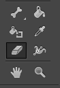

        单击【橡皮擦模式】，系统将弹出包括5种橡皮擦模式的菜单。如图4-3-8所示。

## 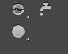

        【标准擦除】：可以擦除舞台中位于同一图层上的任意图形的边线和填充内容。

        【擦除填色】：仅擦除填色内容，边线不受影响。

        【擦除线条】：仅擦除线段，填充内容不受影响。

        【擦除所选填充】：仅擦除选中图形的填充内容。

        【内部擦除】：仅擦除单击点所在图形的填充内容，如果起始点为空白，将不会擦除任何图形。

        单击【水龙头】：可以将图形的填充色或轮廓线去掉。

        单击【橡皮擦形状】：可以选择不同的橡皮擦形状和大小。

